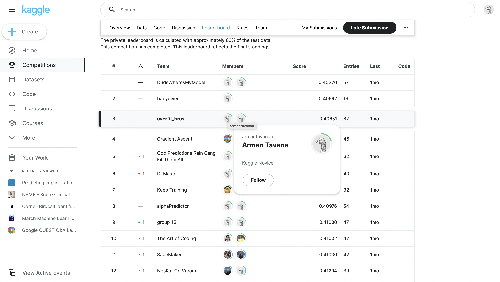

# Implicit Rating Prediction (Kaggle Competition)
In this repo I worked with a classmate to write models in order to predict implicit ratings. In this real world data from booking.com we have users(travelers) and items (citites) and our goal was to recomond cities to travelers. We were able to achieve a log loss of 0.4065 and ranked third place in the Kaggle competition among 50+ teams. 

### Techniniques Used:
1. We used negative sampling in order to randomly put negative weights on some items(cities) that a user has not visited.
2. We then tried different models such as matrix factorization and neural networks.
3. We used embedding methods to represent users, items, and features as a dense vector.
4. We also used the technique of average embedding to better predict for users that did not exist in our training dataset.
5. During this project we worked on hyperparameter tuning in order to achieve the most optimized models. Hyperparameters such as embedding size, learning rate, weight decay, number of epochs and more.
6. Lastly we used ensembling (similar to random forest) and took average of the result of our best matrix factorization and neural network models in order to achieve our best loss (0.4065).

Thanks to my teammate [Kaihang Zhao](https://github.com/KaihangZhao) for working on this project with me.
